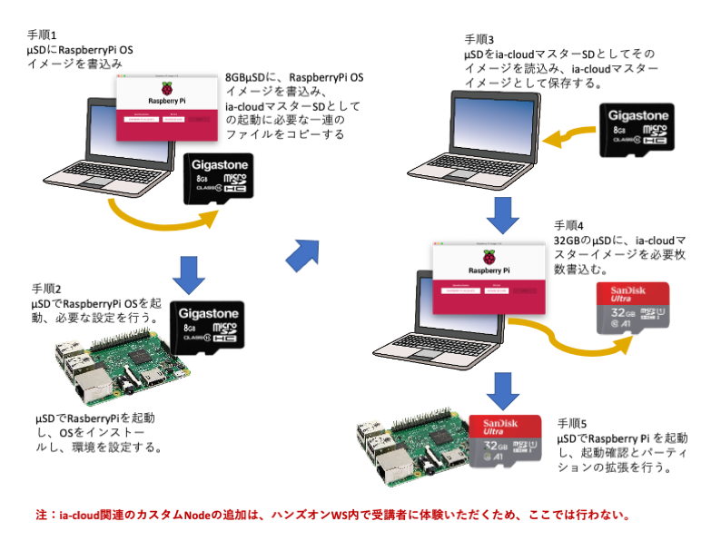

# DIY実践IoT活用ハンズオンワークショップ

## RaspberryPi（Raspberry Pi OS）のインストールとネットワーク環境設定に関するドキュメントとスクリプトおよび設定データ

## 概要
これら一連のファイルは、IAF ia-cloudプロジェクトが実施支援する、DIY実践IoT活用ハンズオンワークショップ（以下ハンズオンWS）で使用されるRaspberryPi OS のインストールと環境設定に必要なデータファイル、スクリプトおよびそれらのドキュメントである。 
下図にハンズオンWSで使用する、マスターイメージファイルの作成の手順を示す。 



## 手順１：RaspberryPi OS 起動マイクロSDカードの作成

以下の手順で、RaspberryPi OS 起動マイクロSDカードの作成を作成する。

- Raspberry Pi OS公式サイト https://www.raspberrypi.org/downloads/ から、Raspberry Pi Imager アプリケーションを利用環境に応じてダウンロード。  
- アプリケーションを起動し、マイクロSDカード(μSD)にRaspberry Pi OS(32-bit) a port of Debian with Raspberry Pi Deasktop(Recommended)を WRITE する。  


- 使用するマイクロSDカードの容量は、最8GBである。  
- 書き込みが終了すると、SDカードは取り外されるので、確認の上再度挿入する。

### RaspberryPiのネットワーク設定スクリプトおよび設定データを準備する　　
  
RaspberryPi OS 起動マイクロSDカードの/boot領域に、設定作業で必要なファイル群をコピーする。

#### マイクロSDカードの /boot 直下に以下のファイルを配置する
wifi環境で、ヘッドレス（モニタ・キーボード・マウスを使用せず）での設定を行う場合は、以下のファイルをマイクロSDカードの /boot 直下に以下のファイルを配置する。モニタ・キーボード・マウスを使用して作業を実施する場合は、これらのファイルは不要である。

- wpa_supplicant.conf
- ssh

wpa_supplicant.confは、一連の作業を実施するWifi環境のSSIDとパスワードが記載され、sshファイルはsshでの接続を可能とするための空のファイルである。

```
country=JP
ctrl_interface=DIR=/var/run/wpa_supplicant GROUP=netdev
update_config=1
network={
    ssid="wifi環境のSSIDを記載"
    psk="パスワードを記載"
}
```
#### マイクロSDカードの/boot/ia-cloud にhands-on-start.service.orgを配置する。
  
マイクロSDカードの/bootにサブディレクトリー ia-cloud を作成し、/boot/ia-cloud に本レポジトリーのsetupにあるファイル、hands-on-start.service.orgを配置する。  

ファイルの内容は以下
```
[Unit]
Description = excute ia-cloud start up script
After=local-fs.target
ConditionPathExists=/opt/ia-cloud/bin

[Service]
ExecStart=/opt/ia-cloud/bin/hands-on-start.sh
Restart=no
Type=simple

[Install]
WantedBy=multi-user.target

```
#### マイクロSDカードの/boot/ia-cloud にhands-on-start.shを配置する。  

マイクロSDカードの/boot/ia-cloud にhands-on-start.shを配置する。このスクリプトは/boot/ia-cloudに、hands-on-config.jsonが存在すると、それを読み込んで、そこに記述された内容によって、ネットワーク設定を変更するため以下のファイルを変更する。
  * /etc/dhcpcd.conf
  * /etc/wpa_supplicant/wpa_supplicant.conf
  * /etc/test_hostname
  * /etc/test_hosts

変更するのは、IPアドレス・デフォルトゲートウエイ、WifiのSSIDとパスワード、hostnameである。  
  
変更後は、hands-on-config.json のファイル名を、自動でhands-on-config.json.org に変更し再起動を行う。  

#### マイクロSDカードの/boot/ia-cloud にhands-on-config.json.org を配置する。  
マイクロSDカードの/boot/ia-cloud にhands-on-config.json.org を配置する。 このファイルは、個別にネットワーク設定等を変更するスクリプト、hands-on-start.shが参照するデータファイルである。ハンズオンWS用の個別の起動マイクロSDカードの作成の際に、必要な設定を行なった後hands-on-config.jsonにファイル名変更して使用すること。  
このファイルの内容は以下である。
```
{
    "name": "RaspberryPi configuration at the first boot",
    "comment": "test for configuration procedure",

    "lan-config": {
        "ip-address": "192.168.xx.xx/24",
        "default-gateway": "0.0.0.0"
    },
    "wifi-config": {
        "type": "wpa",
        "ssid": "xxxxxxxxxx",
        "password": "xxxxxxxxx"
    },
    "hostname": "xxxxxxxxx"
}
```

#### マイクロSDカードに、Node-RED環境や起動時実行の環境など一連の操作をまとめたスクリプトを配置する。

後述のNode-REDインストールをはじめ一連の環境設定のための手順をスクリプトにまとめたファイル、本レポジトリーのsetup/hands-on-install.shを、/boot/ia-cloudに配置する。  
<br>
### 以上で、マイクロSDカードの書き込みと設定準備は完了である。マイクロSDカードをとり出す。
<br>

## 手順２：ハンズオンWS用マスターSDの作成 （RaspberryPi での作業）

### マイクロSDカードでRaspberry Pi OSを起動し設定を行う  

- RaspberryPiに装着し起動（マウス・キーボード・モニタ接続するか、IPアドレスが分かっていれば、SSHで接続する。）
  - SSHで接続した場合は、sudo raspi-config を実行し、設定画面の
  - 2.Disolay Options -> D1.Resolition -> DTM Mode 85 12880x720 60Hz 16:9 を選択設定
  - 3.Interface Option -> P3.VNC -> Yes を選択設定し、VNCを有効にし、再起動
  - 再起動後、同一アドレスでVNCでの接続を行い、以下の手順を実施する。
- Raspberry Pi OSの初期画面が起動。初期設定画面に従い、インストールを継続
- countryをJAPANに設定
- piユーザのパスワード変更を求められるが無視して続行
- モニタスクリーンのアンダースキャンの確認：どっちでも良い。
- ネットワークの設定は、インストール実行時の環境で設定（LANはデフォルトでDHCP有効になっている。Wifiの場合はここで設定）
- Raspberry Pi OSのアップデートを自動で確認し、アップデートが実行される（数分かかる）。
- 再起動を求められるので、再起動する。Raspberry Pi OSのデスクトップ画面が起動する。
- Raspberry Pi OSのメインメニューから、設定 -> Screen Configurationを選択し、解像度を適宜に設定
- Raspberry Pi OSのメインメニューから、設定 -> RaspberryPiの設定　を起動
- インターフェースタブで、カメラ・SSH・VNC・SPI・I2C・Serial Port　を有効にする。
- 再起動を求められるので再起動
- 再起動後、ユーザpiのパスワードを変更していないとの警告が出るが、ここは無視。


### マイクロSDカードに、Node-REDとその動作環境をインストール

#### RaspberryPiのコンソールないしはVNC/SSHから、/boot/ia-cloud/hands-on-install.sh を実行する。 

```
/boot/ia-cloud/hands-on-install.sh
```
このスクリプトは、以下の一連の手順を自動実行する。途中で、会話型の入力を求められるので「ｙ」を入力する必要がある。  
hands-on-install.shはの実行後、以下のようにリネイムして置くこと

```
sudo mv /boot/ia-cloud/hands-on-install.sh /boot/ia-cloud/hands-on-install.done 
```
  
***
  
まず、Raspberry Pi OS Raspberry Pi OSでのインストールスクリプト前に、以下のコマンドでaptをupdateする。
```
sudo apt update          // aptのupdateコマンド
```
以下のコマンドラインで、必要なJSONハンドリングモジュールをインストールする
```
sudo apt install jq          // JSON処理シェルコマンド
```
Node-REDとその関連モジュールのNode.jsのバージョン依存が発生した場合の回避等のため、nodeバージョン管理 n をインストールし、Node.js 1o を予めインストールしておく。  
これにより、Node.js npm Node-REDを一括インストールするスクリプトでは、Node.js LTS がインストールされるが、n コマンドにて Node.js 10 への復帰や任意のバージョンのインストールが可能となる。

```
sudo apt install npm
sudo apt install nodejs
sudo npm install n -g
sudo n 10
sudo apt purge -y nodejs npm
node -v
```
Node.js npm Node-REDを一括インストールするスクリプトを実行
```
bash <(curl -sL https://raw.githubusercontent.com/node-red/linux-installers/master/deb/update-nodejs-and-nodered)		
```
Node-REDのインストールでは、二つの確認メッセージが出るが、いずれも「ｙ」を入力
このインストールスクリプトの処理には、十数分かかる。  
スクリプトが完了すると、Raspberry Pi OSのメインメニューのプログラミングに、node-REDが現れ、起動できるようになる.  

### マイクロSDカードの/boot/ia-cloud から、設定変更スクリプトおよび設定データを配置する
<br>
Raspberry Pi OS起動時に設定変更のスクリプトを走らせるのに必要なファイルを/bootから移動するため、以下の操作を行う。

#### /opt/ia-cloud/binを作成し、そこに/boot/ia-cloud/hands-on-start.shを移動する。  
```
sudo mkdir -p /opt/ia-cloud/bin
sudo mv /boot/ia-cloud/hands-on-start.sh /opt/ia-cloud/bin/
```
#### /boot/ia-cloud/hands-on-start.service.orgを/etc/systemd/system/に移動し、hands-on-start.serviceに名称変更する。
```
sudo mv /boot/ia-cloud/hands-on-start.service.org /etc/systemd/system/hands-on-start.service
```

#### systemdの変更設定を行う

systemdにユニットファイルを追加・更新したことを通知し、自動起動をenableに設定する。

```
sudo systemctl daemon-reload
sudo systemctl enable hands-on-start.service
```
***
以上で、RaspberryPiのNode-RED実行環境の構築は終了である。

<br>

### Node-REDの起動環境を設定する。

ターミナルコンソールから
```
node-red-start
```
ないしは、メインメニュー　ー＞　プログラミング ー＞　Node-RED　で、
Node-REDを起動する。一度移行すると、
```
/home/pi/.node-red
```
にいくつかのNode-RED関連ファイルが自動で生成される。

#### Node-REDの動作環境設定ファイル setting.js の設定

Node-RED起動後ファイルマネージャなどで、/home/pi/.node-redディレクトリーにある setting.js ファイルを見つけ、テキストエディタにて、paletteCategories 定義文を以下のように書き換える。この定義文はオリジナルではコメントアウトされている。（/home/pi/.node-redは隠しファイルであるので、ファイルマネージャーでは隠しファイルを表示する設定が必要。）

```
paletteCategories: ['subflows', 'common', 'iaCloud services', 'iaCloud devices', 'iaCloud functions'
        , 'iaCloud', 'iaCloud DB acs', 'iaCloud Visuals','iaCloud dashboard', 'iaCloud premium'
        , 'dashboard' , 'function', 'network', 'sequence', 'parser', 'storage'],

```


以上で、マスターSDカードの作成は終了。  
シャットダウンし、マイクロSDカードを取り出す。


## 手順３：ハンズオンWS用の個別のマイクロSDカードのイメージデータを作成（PC or Mac での作業）

以下の手順で、実際のハンズオンで各受講者が使用する個別のマイクロSDカードのイメージデータファイルを作成する。

### マスターSDカードのイメージファイルを作成する。（以下、Macでの例）

マスターのSDカードをMacに接続し、ターミナルから以下の作業を実施。  

SDカードのイメージファイルは、ホームディレクトリーのia-cloud-handson-master.imgとして保存される。
マスターSDカードのマウント先が、/dev/disk2 とすると、
```
sudo dd if=/dev/rdisk2 of=ia-cloud-handson-master.img bs=1m
```
途中経過は表示されないが、Ctl+ｔで経過を表示できる。  
書き込みには役2分ほどかかる。  


## 手順４：受講者が使用する個別のマイクロSDカードを作成。（ハンズオンWS参加者の数だけ実行）
使用するSDカードのは、容量32GBの物を使用する。 
- Raspberry Pi OS公式サイト https://www.raspberrypi.org/downloads/ からダウンロードした、Raspberry Pi Imager アプリケーションを起動。  
- マイクロSDカード(μSD)に、hands-on-master.imgを書き込む。Raspberry Pi Imagerの CHOOSE OS ボタンから、Use Customを選択肢、保存してあるhands-on-master.imgを選択する。


## 手順５：コピーしたSDカードでの起動確認と、パーティション・ファイルシステムの拡張

コピーしたSDカードを挿入し、Raspberry Pi OSが起動することを確認する。   
また、ia-cloudｋのコマンドを実行し、を実行し、ファイルシステムをパーティションの最大まで拡張する。
```
sudo raspi-config  --expand-rootfs
```
  コマンド実行後再起動を行い、ファイルマネージャで残り容量が29GBあることを確認する。

### ハンズオンWSの開催会場等に応じて、参加者ごとのネットワーク設定のための起動時設定ファイルを編集し、リネームする。
/boot/hands-on-config.json.orgを編集し、必要なネットワーク設定を記述する。  
ラズパイ上で作業しても、PCやMac上で作業しても構わない。

```
{
  "name" : "RaspberryPi configuration at the first boot",     // 名称を自由に設定
  "comment" : "test for configuration procedure",             // コメントを自由に記述
  "lan-config" : { "ip-address" : "192.168.xx.xx/24", "default-gateway" : "192.168.xx.xx" },    // 固定IPアドレスを設定
  "wifi-config" : { "type" : "wpsかwepを設定", "ssid" : "ssid文字列を設定", "password" : "パスワード文字列を設定" },      // WifiのSSIDとパスワードを設定
  "hostname" : "ホストネイムを設定"                                // hostnameの設定
}
```
- ファイル名hands-on-config.json.orgをhands-on-config.jsonに変更する。

**Raspberry Pi OSを再起動すると、新しい設定が反映され、個別のSDカードが完成する。**

## ハンズオンワークショップでの、Node-RED node のインストール

ハンズオンワークショップでは、冒頭のNode-RED環境の立ち上げ直後に、以下のNodeモジュールをNode-RED環境のパレット管理メニューからインストールする。これは、Node-RED環境のアップデートとして、受講生のハンズオン実習として実施するのが良い。
